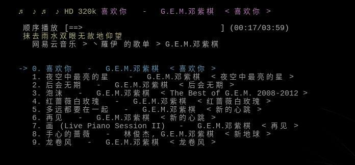
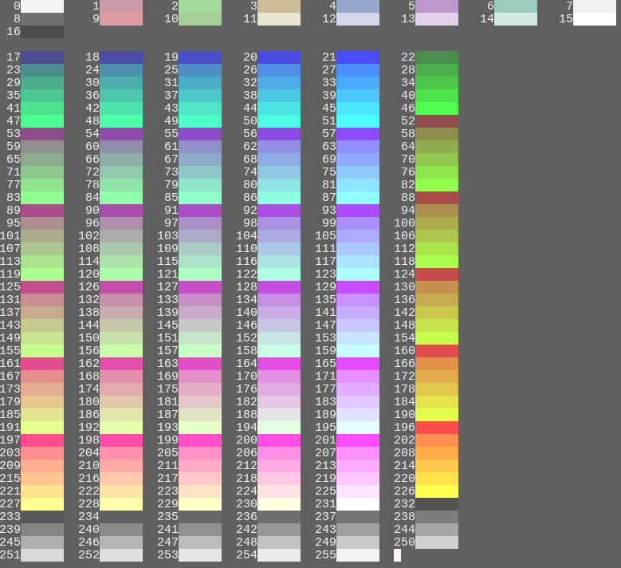

##这是一篇关于我的Gentoo系统下虚拟终端颜色配置的说明

针对于xterm，有个地方设置颜色

+ `~/.Xresource` 这个文件放置在运行X的用户家目录，每次运行X的时候会调用来做基本的一些配置
+ `~/.zshrc` 因为我用的是zsh这个shell，所以提示符都是在这边配置的
+ `~/.vimrc` 不可或缺的vim启动文件，所有vim的设置在这里

`.zshrc` 和 `.vimrc` 不在这边说明，直接看文件即可

目前比较喜欢的一个颜色配置方案如下：
```
.Xresource file:

! black
*color0: #000000
! bright_black
*color8: #343434
! red
*color1: #b66d80
! bright_red
*color9: #cd7079
! green
*color2: #79cd70
! bright_green
*color10: #80b66d                                         
! yellow
*color3: #b6a26d
! bright_yellow
*color11: #dfd7bf
! blue
*color4: #6d80b6
! bright_blue
*color12: #bfc8df
! magenta
*color5: #a26db6
! bright_magenta
*color13: #d7bfdf
! cyan
*color6: #6db6a2
! bright_cyan
*color14: #bfdfd7
! white
*color7: #e8e8e8
! bright_white
*color15: #ffffff

*background: #1c1c1c
*foreground: #efefef
``` 

网上发现的一个可以用于配置颜色的[网址](http://ciembor.github.io/4bit/#)

网易音乐MusicBox下颜色修改直接修改 `ui.py` 文件即可，以下是本地修改的内容：
```
#info
         curses.init_pair(1, 231, curses.COLOR_BLACK)
#hover
         curses.init_pair(2, 117, curses.COLOR_BLACK)
#歌词
         curses.init_pair(3, 229, curses.COLOR_BLACK)
#title
         curses.init_pair(4, 219, curses.COLOR_BLACK)

#        curses.init_pair(1, curses.COLOR_CYAN, curses.COLOR_BLACK)
#        curses.init_pair(2, curses.COLOR_CYAN, curses.COLOR_BLACK)
#        curses.init_pair(3, curses.COLOR_WHITE, curses.COLOR_BLACK)
#        curses.init_pair(4, curses.COLOR_YELLOW, curses.COLOR_BLACK)
```

关于直接显示当前终端下256色的python脚本如下：
```
import curses

def main(stdscr):
    curses.start_color()
    curses.use_default_colors()
    for i in range(0, curses.COLORS):
        curses.init_pair(i, i, 234) #这里的234修改为当前终端背景色较好
    try:
        for i in range(0, 256):
            if(i < 10):
                stdscr.addstr("  " + str(i), 0)
                if(i == 7):
                    stdscr.addstr("██████\n", curses.color_pair(i))
                else:
                    stdscr.addstr("██████  ", curses.color_pair(i))
            elif(i < 100):
                stdscr.addstr(" " + str(i), 0)
                if(i == 15):
                    stdscr.addstr("██████\n", curses.color_pair(i))
                elif(i == 16):
                    stdscr.addstr("██████\n\n", curses.color_pair(i))
                elif((i-16) % 6 == 0 and i > 16):
                    stdscr.addstr("██████\n", curses.color_pair(i))
                else:
                    stdscr.addstr("██████  ", curses.color_pair(i))
            else:
                stdscr.addstr(str(i), 0)
                if((i-16) % 6 == 0):
                    stdscr.addstr("██████\n", curses.color_pair(i))
                else:
                    stdscr.addstr("██████  ", curses.color_pair(i))
    except curses.ERR:
        # End of screen reached
        pass
    stdscr.getch()

curses.wrapper(main)
```

目前网易云音乐MusicBox的截图：


目前终端颜色设置情况（By Python）：

