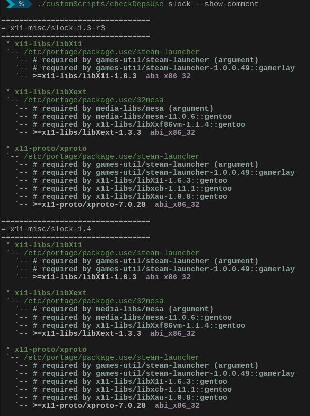

##说明

这里面将会是一些简单的脚本

+ [ydcv.sh](#ydcvsh) [2016-11-28更新]
+ [checkDepsUse.sh](#checkdepsusesh) [2016-11-28更新]


###ydcv.sh

先上图：


一个 bash 脚本写的有道词典控制台版，里面的 api 接口账户没写，有需要的直接去[有道](http://fanyi.youdao.com/openapi?path=data-mode)申请即可，秒申。

这个脚本需要先安装 [jq](https://stedolan.github.io/jq/) ，纯 bash 实现等有空了搞。

不输入查询单词会进入交互界面（也就是循环查询界面），为了使 CTRL-D 可以退出，目前在交互界面不输入任何内容直接回车也会退出交互界面，如果你不需要 CTRL-D 退出的功能，可以把脚本里面 `blackCharOpt` 变量改成 `continue` 即可。


###checkDepsUse.sh

```
Usage: ./checkDepsUse.sh packageName [--single] [--show-comment]

这个脚本需要先安装好 equery ，其他命令都应该是自带有的
可以查看到提供包所依赖的关系包下自定义了哪些非全局 use ，在哪个文件里面（默认都是在 /etc/portage/package.use/ 下的分立文件内查找）

 --single         不去计算依赖关系，直接查询提供包名已经设定了哪些非全局 use
 --show-comment   这个依赖于 /etc/portage/package.use/ 目录内分立文件中对应 use 设置上部是否有注释，有的话显示出来。

```
如图：




可以发现，重复的真多.. 我也懒得整理
